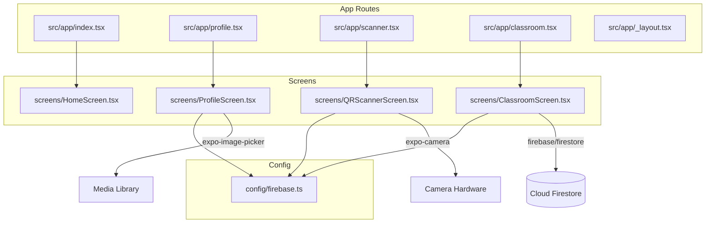
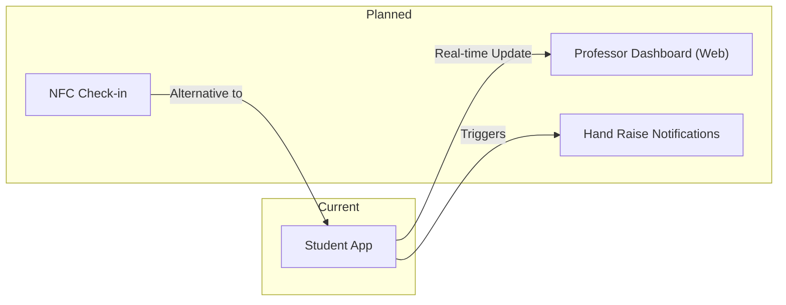

# Project Knowledge Graph

This project uses a dynamic knowledge graph generated via a Python script. This ensures the map stays up-to-date as the codebase evolves.

## 📊 Dynamic Knowledge Graph (JSON)
The primary data source for the project's knowledge graph is:
`/.agents/docs/knowledge_graph.json`

This file is structured for programmatic use by AI agents and contains:
- **Nodes**: Files (implemented), Vision components (planned), and External modules.
- **Links**: Imports, dependencies, and logical relations.

### How to Update
To regenerate the knowledge graph after code changes, run the following script from the project root:

```bash
python3 .agents/scripts/generate_knowledge_graph.py
```

---

## 🗺️ Visual Overview (Mermaid)
Below is a static visual representation of the current core architecture for quick reference.

### File Dependency Graph (Imports)



## 🚀 Full Project Vision (Planned)


